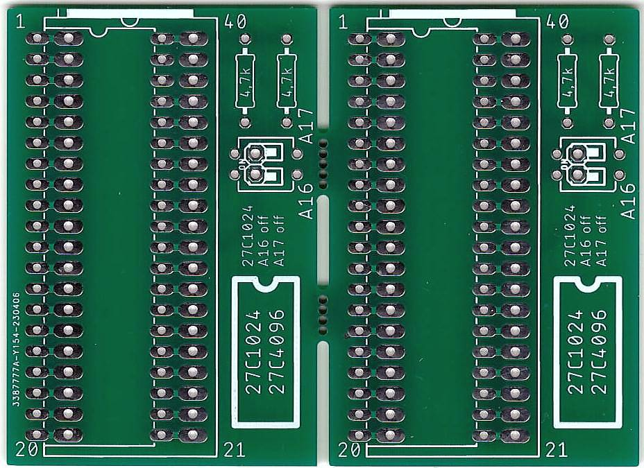

# Gigatron ROM Adapter
This is my first attempt for a simple ROM adapter for the Gigatron TTL. There are two good reasons for this.
The first is, there is no inexpensive ZIF socket that fits directly on the mainboard. If you use a turned socket on the mainboard and turned pins for the adapter, then it adds a ZIF socket to the Gigatron.
My second problem is that to test different software I often have to change the ROM. This is inconvenient because I have to remove the cover from my Gigatron case each time.
The adapter allows the use of a 256k x16 EPROM. This allows, via a switch or jumper, switching 4 different ROM's. 
One possible EPROM is the 27C4002. I found it in China and at the local dealer. (https://www.reichelt.de/eprom-4-mb-256-k-x-16-4-5-5-5-v-fdip-40-27c4002-100-p1930.html?&nbc=1)
In China I also found the W27C4096, a pin compatible EEPROM.

Theoretically, a simple ROM banking would also be possible in this way to extend the Gigatron ROM.

I have tested the ROM switch with the 27C4002. The 27C4002 can be programmed with the TL866II or successor devices. With both switches in the off position, the original Gigatron ROM can also be used.

